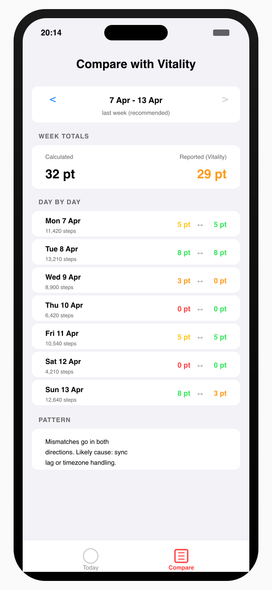

# Eightful

  

An Apple Watch complication and iPhone app that shows your progress toward the 8-point daily activity target used by [Vitality Health](https://www.vitality.co.uk).

The difference is the colour. White below 6,500 steps. **Red** when you're within 500 steps of 7,000, 10,000 or 12,500 — push now, there's a point on the other side. Orange, yellow and green as you bank 3, 5 and 8 points.

  

## Why

The official Vitality app is great at telling you what you've already earned. It's not great at nudging you before you miss a point. A night at 6,847 steps costs you three points; nobody finds out until tomorrow. Eightful is the thing on your wrist that reminds you, at a glance, that 153 steps stands between you and a point.

## What it does

- **Live step count** on your watch face, colour-coded by points tier
- **One daily nudge** at a time you choose — silent if you've hit green
- **Workout detection** — flips green early when a 60-min Z2 or 30-min Z3+ workout banks the 8 points ahead of steps
- **Compare tab** on iPhone — spot when your calculated points disagree with what Vitality reports

  
  

## Privacy

Everything happens on your devices. Step counts, workout data, settings, and any points you manually enter in the Compare tab are stored locally. Nothing is sent to us (we have nowhere to send it to), nothing is sent to Vitality, nothing goes anywhere else.

Full [privacy policy](/eightful/privacy).

## Disclaimer

Eightful is an independent tool, not affiliated with, endorsed by, or connected to Vitality Health Insurance. The 7,000 / 10,000 / 12,500 step thresholds and HR-based workout rules implement Vitality's published activity scoring. For authoritative rules and point awards, check your Vitality Member account.

## Get it

App Store link coming soon.

## Support the project

<a href="https://ko-fi.com/smagdali" target="_blank">☕ Buy Stef a coffee</a>

Eightful is free and always will be. If it's saving you points and you fancy it, you can throw a coffee my way.

## Contact

[stefan@whitelabel.org](mailto:stefan@whitelabel.org)

[Source on GitHub](https://github.com/smagdali/eightful)
